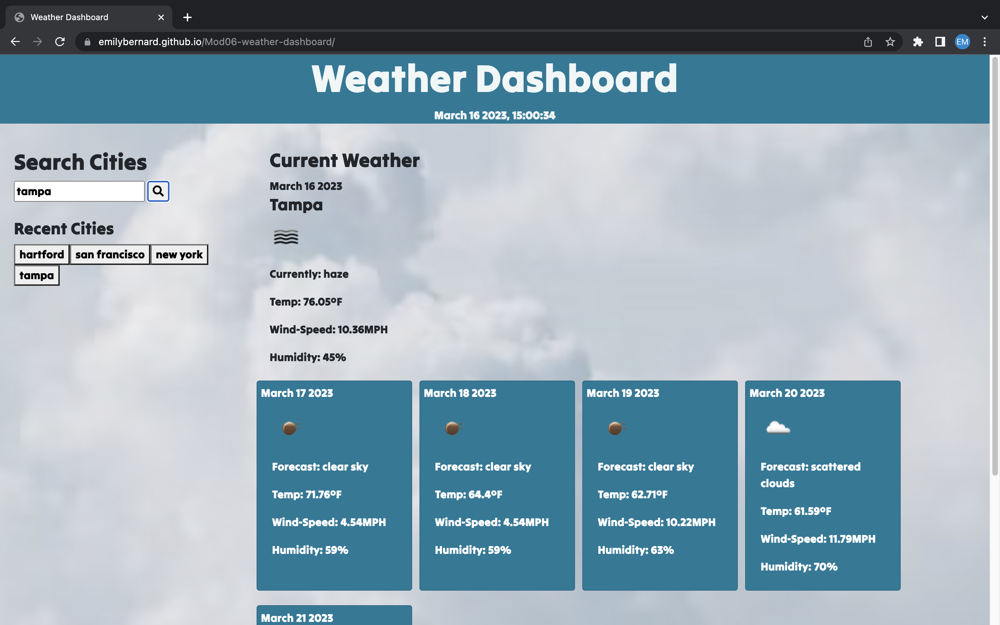

# Mod06-weather-dashboard
A website to see the weather outlook for multiple cities for planning purposes

# Project Status
Submitted for evaluation

# Project Deployed

https://github.com/EmilyBernard/Mod06-weather-dashboard
 
https://emilybernard.github.io/Mod06-weather-dashboard/

# Screenshot of webpage

# User Story
AS A traveler I WANT to see the weather outlook for multiple cities SO THAT I can plan a trip accordingly

# Original Assignment Criteria
<ul>
<li>GIVEN a weather dashboard with form inputs
<li>WHEN I search for a city
<li>THEN I am presented with current and future conditions for that city and that city is added to the search history
<li>WHEN I view current weather conditions for that city
<li>THEN I am presented with the city name, the date, an icon representation of weather conditions, the temperature, the humidity, and the the wind speed
<li>WHEN I view future weather conditions for that city
<li>THEN I am presented with a 5-day forecast that displays the date, an icon representation of weather conditions, the temperature, the wind speed, and the humidity
<li>WHEN I click on a city in the search history
<li>THEN I am again presented with current and future conditions for that city
</ul>

# Authors and acknowledgement
Emily Bernard

